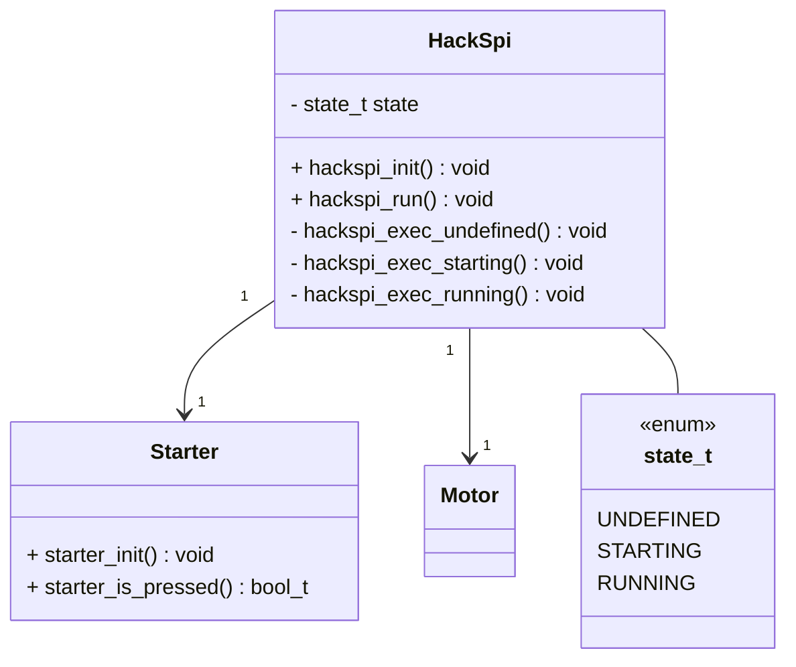
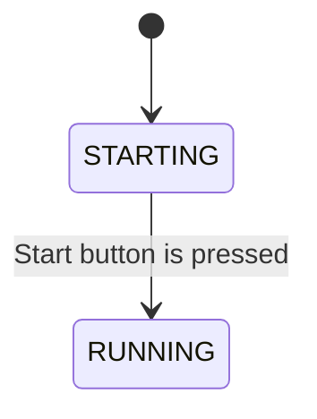

# ETロボコンのRasPike用のテンプレート

ETロボコンで使用するRasPike用のテンプレートファイルです。

## 設計

### クラス図



### ステートマシン図



### シーケンス図

```mermaid
sequenceDiagram
  rect rgb(150,150,100)
  TASK->>HackSpi: hackspi_init()
  HackSpi->>Starter: starter_init()
  end

  rect rgb(100,100,150)
  TASK->>HackSpi: hackspi_run()
  HackSpi->>Starter: starter_is_pressed()
  Starter-->>HackSpi: is pressed
  HackSpi->>(LeftMotor) Motor: ev3_motor_set_power(port, power)
  HackSpi->>(RightMotor) Motor: ev3_motor_set_power(port, power)
  end
```
